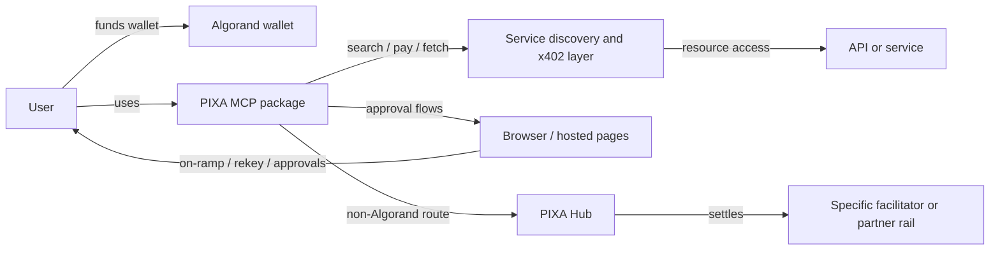
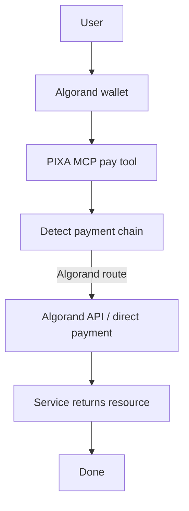
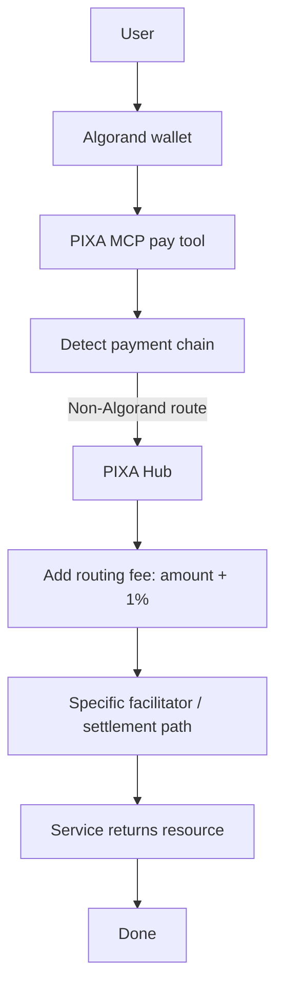
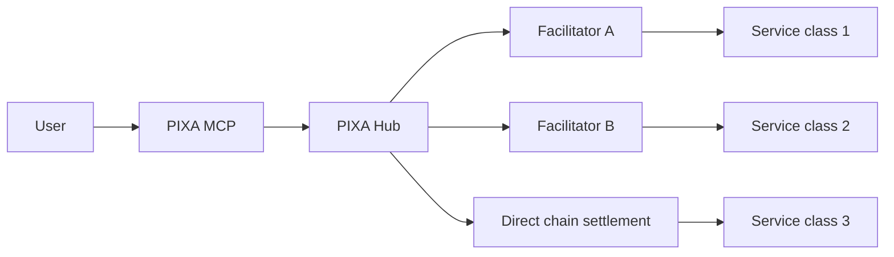
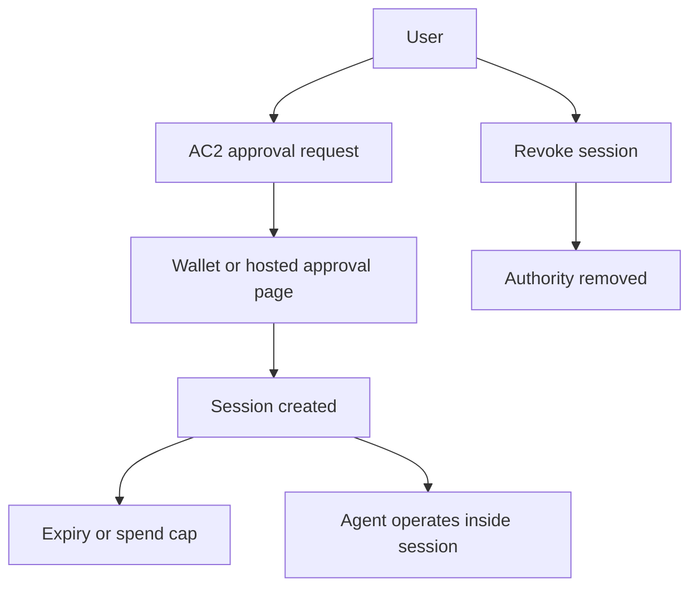

# Architecture

PIXA is easiest to understand as a layered system:

- the MCP package that Claude Desktop or another agent runtime loads
- the browser-based approval flows for on-ramp, rekey, and other user actions
- the PIXA Hub payment router for non-Algorand settlement paths
- the service discovery and x402 payment layer
- the future AC2 session layer for bounded delegation

## 1. Core Architecture

This is the main architecture image for PIXA.

<Frame>
  
</Frame>

This diagram shows the primary product split:

- agent flow starts with search and payment intent
- the chain is detected after the payment attempt
- Algorand routes stay free and direct
- non-Algorand routes add the PIXA Hub fee and settle through a facilitator
- the service is released after settlement

PIXA keeps one user-visible wallet, then routes the rest of the complexity behind the scenes.

## 2. Normal Algorand Payment Flow

This is the fast path when the service can be paid directly from the Algorand side.

This is the cleanest path for direct wallet-backed API access.

## 3. Non-Algorand Payment Flow

When the target service is on another chain, PIXA adds a hub step and a small routing fee.

This is the operator-backed path that lets PIXA support other chains without giving the user multiple wallets.

## 4. Multi-Facilitator Settlement View

PIXA does not need to rely on only one execution path forever. Different services can be settled by different facilitators.

The point is not that one backend must handle everything. The point is that the user should only see one control surface.

## 5. AC2 Session Model

This is the future bounded-authority layer for higher-risk actions.

AC2 is how PIXA can move from simple payment routing to explicit delegated authority.

## 6. What Each Block Does

- MCP package: exposes the tools the agent calls
- Browser page: handles approval-heavy actions that should not stay inside the Claude iframe
- PIXA Hub: handles treasury-backed routing and non-Algorand settlement
- Facilitator: executes the actual settlement or relay step for a specific network
- AC2: turns approval into a temporary, revocable session instead of a one-time yes/no click

## 7. Reading Order

If you are explaining PIXA to a judge or developer, read it in this order:

1. one Algorand-funded wallet
2. direct Algorand payment path
3. non-Algorand hub path with the routing fee
4. multi-facilitator settlement behind the hub
5. AC2 session control for stricter authority

That order matches the product from simplest to most advanced.
